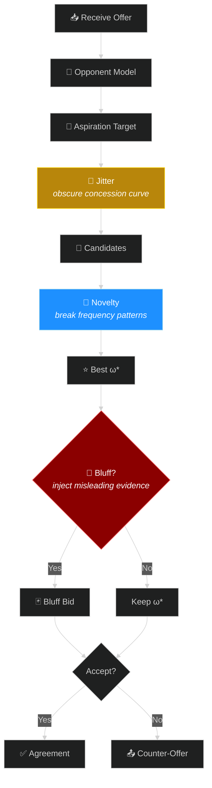
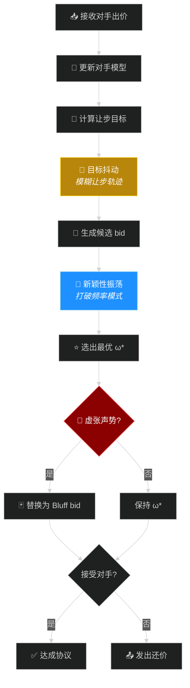
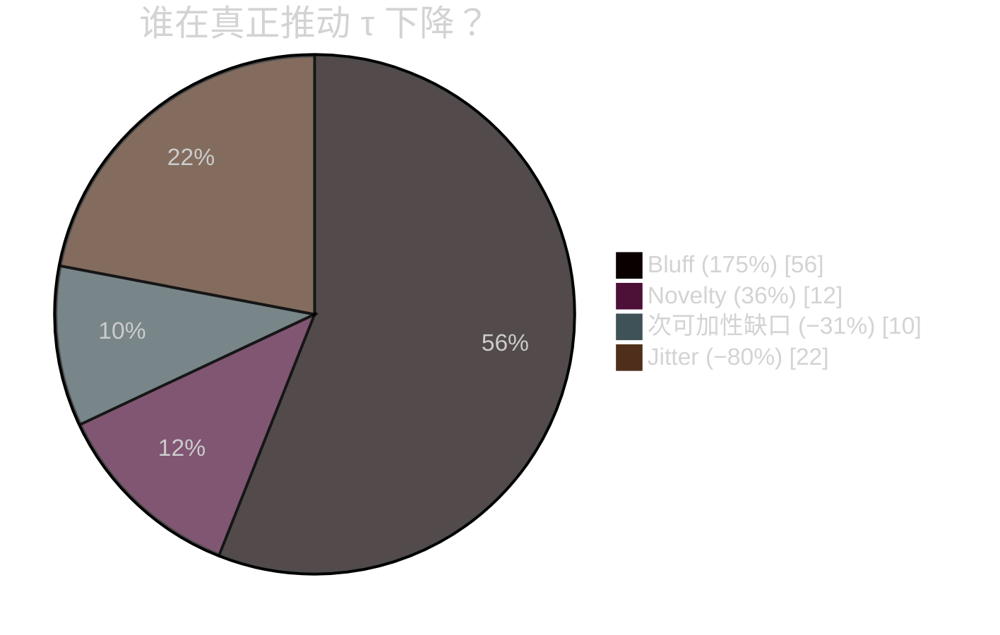

<p align="center">
  
  
  
  
</p>

<h1 align="center">🛡️ AdaptiveBathNegotiator</h1>
<p align="center">
  <b>Your opponent is learning from every bid you send.<br/>Make sure they learn the wrong thing.</b>
</p>

---

## Why This Matters

In automated negotiation, opponent modeling is usually treated as a superpower — the better you model them, the more value you extract. **But the knife cuts both ways.** Every bid you send is a training sample for *their* model. Smooth concession curves, repeated issue values, stable utility bands — these are exactly the patterns that frequency-based and Bayesian attackers exploit.

**AdaptiveBathNegotiator** is the first negotiation agent designed from the ground up to **control what observable bids reveal**, without sacrificing agreement quality.

| | OFF (no privacy) | Random Noise | **FULL (ours)** |
|---|:---:|:---:|:---:|
| Utility | 0.548 | 0.549 | 0.525 (−4.1%) |
| Attacker accuracy (τ) | 0.566 | 0.576 (worse!) | **0.560** |
| Agreement rate | 97.5% | 97.5% | **97.8%** |

> Random noise makes things *worse*. Structured concealment works.

## How It Works



Three concealment layers at distinct pipeline stages — not undirected noise:

| Stage | Mechanism | What It Does |
|------|-----------|--------------|
| 🎯 Aspiration | Target Jitter | Perturbs the concession target so attackers can't reconstruct the curve |
| 🎲 Candidate | Novelty Oscillation | Alternates exploration / convergence to break value-frequency patterns |
| 🃏 Selection | Guarded Bluff | Occasionally sends a plausible-but-misleading bid (utility-bounded) |

## Layer Contribution


Bluff dominates τ reduction. The three layers are **sub-additive** — the full config's effect is smaller than the sum of individual layers, confirming they operate on distinct but overlapping signals.

## Ablation Results

*8 domains × 5 opponents × 7,200 negotiations*

| Config | Utility | τ (Bayesian) | Exploit Loss | 
|:---|---:|---:|---:|
| OFF | 0.548 | 0.566 | 0.037 |
| Jitter | 0.548 | 0.570 | 0.026 |
| Novelty | 0.544 | 0.564 | 0.031 |
| **Bluff** | 0.523 | **0.556** | 0.063 |
| **FULL** | 0.525 | 0.560 | 0.050 |
| Random | 0.549 | 0.576 | 0.032 |

### Key Finding: Exploitation Asymmetry

Jitter and Novelty reduce exploitation loss (−31%, −16%). Bluff **increases** it by 69% while delivering the best τ concealment. Choosing concealment layers means choosing which dimension to protect.

## Quick Start

```bash
pip install -r requirements.txt
python main.py run          # single negotiation
python main.py tournament   # full tournament
```

```
adaptive_bath_agent.py   # Core agent
ceanl.py                 # ANL competition entry point
main.py                  # CLI
leakage_attackers.py     # Attacker models (CF / RF / Bayesian)
examples/                # Opponent implementations
scenarios/               # 8 benchmark domains
```

---

<h1 align="center">🛡️ AdaptiveBathNegotiator</h1>
<p align="center">
  <b>你发出的每一个出价，都在训练对手的模型。<br/>我们的目标：该让步时让步，但让对手学到错误的东西。</b>
</p>

---

## 为什么这个问题重要

在自动谈判领域，对手建模长期被视为纯收益——模型越准，我方获利越高。**但这把刀是双向的。** 你发出的每一个 bid，同时也是对手模型的训练样本。平滑的让步曲线、反复出现的高权重议题取值、稳定的出价区间——这些恰恰是频率型和贝叶斯型攻击者最擅长的切入点。

**AdaptiveBathNegotiator** 是首个从底层设计就围绕「控制可观测出价泄露多少信息」的谈判智能体，且不以牺牲协议质量为代价。

| | OFF (无隐私保护) | 随机噪声 | **FULL (本文方法)** |
|---|:---:|:---:|:---:|
| 谈判效用 | 0.548 | 0.549 | 0.525 (−4.1%) |
| 攻击者准确度 (τ) | 0.566 | 0.576 (不降反升!) | **0.560** |
| 协议达成率 | 97.5% | 97.5% | **97.8%** |

> 随机噪声不仅无效，还会让泄露更严重。结构化隐藏才是正确方向。

## 工作原理



三阶段分别在出价管线的不同节点施加受控扰动——绝非无差别随机加噪：

| 阶段 | 机制 | 作用 |
|------|------|------|
| 🎯 目标层 | 目标抖动 (Jitter) | 对让步目标施加小幅随机扰动，防止攻击者从让步轨迹反推效用上限 |
| 🎲 候选层 | 新颖性振荡 (Novelty) | 交替切换探索/收敛模式，破坏对手从议题-取值频率中学习权重的路径 |
| 🃏 选择层 | 受控虚张声势 (Bluff) | 以低概率发送偏离真实偏好、但仍满足效用下限的误导性出价 |

## 各层贡献



虚张声势 (Bluff) 是绝对主力。三层之间呈**次可加性 (sub-additive)**——组合效果小于各层单独效果之和，证实它们作用于不同但部分重叠的统计信号通道。

## 消融实验结果

*8 个谈判域 × 5 类对手 × 30 随机种子 = 7,200 场谈判*

| 配置 | 效用 | τ (Bayesian) | 利用损失 |
|:---|---:|---:|---:|
| OFF (无隐藏) | 0.548 | 0.566 | 0.037 |
| 仅 Jitter | 0.548 | 0.570 | 0.026 |
| 仅 Novelty | 0.544 | 0.564 | 0.031 |
| **仅 Bluff** | 0.523 | **0.556** | 0.063 |
| **FULL (三层全开)** | 0.525 | 0.560 | 0.050 |
| 随机噪声对照 | 0.549 | 0.576 | 0.032 |

### 关键发现：利用损失的非对称性

Jitter 和 Novelty 在两个维度上同时提供保护——既降低 τ 又降低利用损失（分别为 −31% 和 −16%）。但 Bluff 呈现相反特征：在取得最佳 τ 隐藏效果的同时，利用损失反而**增加 69%**。排名隐藏与接受阈值保护是可以反向移动的两个目标——选择隐藏策略，就是在选择优先保护哪个维度。

## 快速开始

```bash
pip install -r requirements.txt
python main.py run          # 单场谈判
python main.py tournament   # 完整锦标赛
```

```
adaptive_bath_agent.py   # 核心智能体
ceanl.py                 # ANL 竞赛入口
main.py                  # 命令行工具
leakage_attackers.py     # 攻击者模型 (CF / RF / Bayesian)
examples/                # 对手实现
scenarios/               # 8 个基准谈判域
```

---

## Citation

```bibtex
@article{chen2026concealing,
  title   = {Concealing Preference Information in Automated Negotiation:
             A Multi-Stage Bidding Strategy Against Opponent Modeling},
  author  = {Chen, Long and Lv, Yichen and Fujita, Katsuhide and
             Chang, Shengbo and Wu, Zigao},
  journal = {ANL 2026},
  year    = {2026}
}
```
