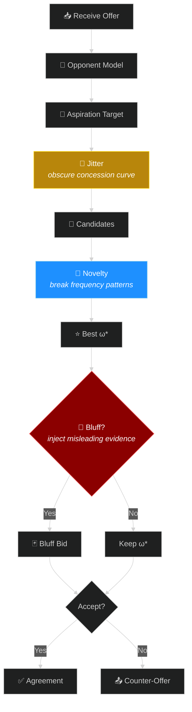
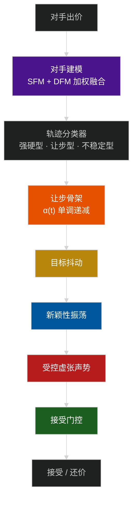

<p align="center">
  
  
  
  
</p>

<h1 align="center">🛡️ AdaptiveBathNegotiator</h1>
<p align="center">
  <b>Your opponent is learning from every bid you send.<br/>Make sure they learn the wrong thing.</b>
</p>

---

## Why This Matters

In automated negotiation, opponent modeling is usually treated as a superpower — the better you model them, the more value you extract. **But the knife cuts both ways.** Every bid you send is a training sample for *their* model. Smooth concession curves, repeated issue values, stable utility bands — these are exactly the patterns that frequency-based and Bayesian attackers exploit.

**AdaptiveBathNegotiator** is the first negotiation agent designed from the ground up to **control what observable bids reveal**, without sacrificing agreement quality.

| | OFF (no privacy) | Random Noise | **FULL (ours)** |
|---|:---:|:---:|:---:|
| Utility | 0.548 | 0.549 | 0.525 (−4.1%) |
| Attacker accuracy (τ) | 0.566 | 0.576 (worse!) | **0.560** |
| Agreement rate | 97.5% | 97.5% | **97.8%** |

> Random noise makes things *worse*. Structured concealment works.

---

## How It Works



Three concealment layers at distinct pipeline stages — not undirected noise:

| Stage | Mechanism | What It Does |
|------|-----------|--------------|
| 🎯 Aspiration | Target Jitter | Perturbs the concession target so attackers can't reconstruct the curve |
| 🎲 Candidate | Novelty Oscillation | Alternates exploration / convergence to break value-frequency patterns |
| 🃏 Selection | Guarded Bluff | Occasionally sends a plausible-but-misleading bid (utility-bounded) |

## Layer Contribution


Bluff dominates τ reduction. The three layers are **sub-additive** — the full config's effect is smaller than the sum of individual layers, confirming they operate on distinct but overlapping signals.

## Ablation Results

*8 domains × 5 opponents × 7,200 negotiations*

| Config | Utility | τ (Bayesian) | Exploit Loss | 
|:---|---:|---:|---:|
| OFF | 0.548 | 0.566 | 0.037 |
| Jitter | 0.548 | 0.570 | 0.026 |
| Novelty | 0.544 | 0.564 | 0.031 |
| **Bluff** | 0.523 | **0.556** | 0.063 |
| **FULL** | 0.525 | 0.560 | 0.050 |
| Random | 0.549 | 0.576 | 0.032 |

### Key Finding: Exploitation Asymmetry

Jitter and Novelty reduce exploitation loss (−31%, −16%). Bluff **increases** it by 69% while delivering the best τ concealment. Choosing concealment layers means choosing which dimension to protect.

## Quick Start

```bash
pip install -r requirements.txt
python main.py run          # single negotiation
python main.py tournament   # full tournament
```

```
adaptive_bath_agent.py   # Core agent
ceanl.py                 # ANL competition entry point
main.py                  # CLI
leakage_attackers.py     # Attacker models (CF / RF / Bayesian)
examples/                # Opponent implementations
scenarios/               # 8 benchmark domains
```

---

<h1 align="center">中文说明</h1>

## 一句话总结

**你在谈判中发出的每一个 bid，都是对手建模的训练样本。AdaptiveBathNegotiator 的目标是：该让步时让步，但让对手学到错误的东西。**

## 核心思路

自动谈判领域的研究，长期以来默认「对手建模」是纯收益——对手模型越准，我方收益越高。但这是一个**双向问题**：你的让步曲线、重复选值、稳定出价区间，同样在训练对手的模型。

我们提出了**三阶段偏好隐藏策略**，针对出价流程的三个信息泄露点分别施加受控扰动：

| 阶段 | 机制 | 原理 |
|------|------|------|
| 目标层 | 目标抖动 (Jitter) | 对让步目标施加小幅度随机扰动，防止对手从让步轨迹反推效用上限 |
| 候选层 | 新颖性振荡 (Novelty) | 交替切换探索/收敛模式，打破对手从议题-取值频率中学习权重的路径 |
| 选择层 | 受控虚张声势 (Bluff) | 以低概率发送偏离真实偏好但仍可接受到误导性出价 |

**关键洞察：随机噪声不仅无效，还会帮倒忙。** 同等强度的随机扰动产生的泄露反而最高——因为噪声增加了方差却没有破坏对手模型依赖的底层统计规律。有效的隐私保护必须理解对手模型*如何学习*，而非简单加噪。

## 实验结果概要

8 个域 × 5 类对手 × 30 随机种子 = 7,200 场谈判：

- FULL 配置仅以 **4.1% 的效用代价** 换取了 Kendall τ 的显著下降
- **Bluff 是绝对主力**，贡献了 132–175% 的 τ 降低效果
- Jitter 单独使用时对 Bayesian 攻击者**反而增加泄露**（−80% 贡献）
- 三层之间呈**次可加性**（sub-additive）：组合效果 < 单独效果之和
- 在 exploitation loss 维度，Bluff 表现相反：降低 τ 但**增加 69% 的 exploitation 风险**——排名隐藏与接受阈值保护是两个可以反向移动的目标

## 架构



## 引用

```bibtex
@article{chen2026concealing,
  title   = {Concealing Preference Information in Automated Negotiation:
             A Multi-Stage Bidding Strategy Against Opponent Modeling},
  author  = {Chen, Long and Lv, Yichen and Fujita, Katsuhide and
             Chang, Shengbo and Wu, Zigao},
  journal = {ANL 2026},
  year    = {2026}
}
```
