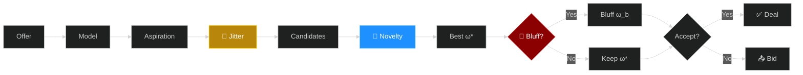
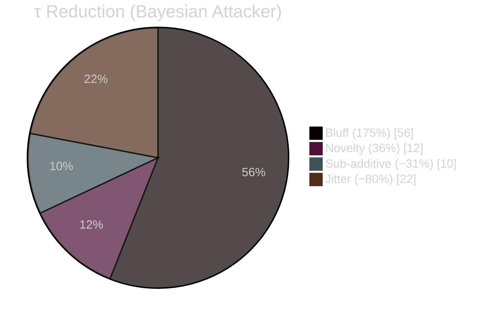

# AdaptiveBathNegotiator — ANL 2026

**Preference-concealing bilateral negotiation agent with multi-stage privacy protection.**

Built on [NegMAS](https://negmas.readthedocs.io/), ANL 2026.

---

## Bidding Pipeline



Three concealment stages (colored) intercept at distinct points: aspiration, candidate scoring, and final selection.

---

## Architecture

```mermaid
%%{init: {'theme': 'dark'}}%%
graph TB
    O[Opponent Bids] --> OM[Opponent Model<br/>SFM + DFM weighted]
    OM --> TA[Trajectory Classifier<br/>Hardliner · Conceder · Erratic]
    TA --> ASP[Concession Backbone<br/>α(t) monotonic descent]
    ASP --> JIT[Target Jitter<br/>ε ~ U(−δ, +δ)]
    JIT --> NOV[Novelty Oscillation<br/>λ_N ∈ {low, high}]
    NOV --> BLF[Guarded Bluff<br/>u_A ≥ θ·u_A(ω*)]
    BLF --> GATE[Acceptance Gate<br/>u_A(ω_B) ≥ max(ω*−η, rv)]
    GATE --> OUT[Accept / Counter]

    style OM fill:#4a148c,color:#fff
    style ASP fill:#e65100,color:#fff
    style JIT fill:#b8860b,color:#fff
    style NOV fill:#01579b,color:#fff
    style BLF fill:#b71c1c,color:#fff
    style GATE fill:#1b5e20,color:#fff
```

### Mechanisms

| Stage | Mechanism | Formula |
|:---|:---|:---|
| Aspiration | Target Jitter | $\tilde{\alpha}(t) = \alpha(t)(1 + \epsilon_t),\ \epsilon_t \sim \mathcal{U}(-\delta,\delta)$ |
| Candidate | Novelty Oscillation | $\lambda_N(r)$ alternates high (explore) / low (converge) per round |
| Selection | Guarded Bluff | $p_b$ probability; $u_A(\omega_b) \geq \theta_b \cdot u_A(\omega^*)$ |

---

## Results

*8 domains × 5 opponents × 7,200 negotiations. Lower τ = better concealment.*

### Privacy vs Utility

```
Config      Utility              τ (Bayesian)
──────      ────────────────────  ────────────
OFF         0.548 ██████████████  0.566 ████████████▌
Jitter      0.548 ██████████████  0.570 █████████████
Novelty     0.544 █████████████▋  0.564 ████████████▎
Bluff       0.523 ████████████▌   0.556 ████████████  ← best τ
FULL        0.525 ████████████▋   0.560 ████████████▎
Random      0.549 ██████████████  0.576 █████████████▌ ← worst τ
```
> FULL: τ −0.006 at **4.1%** utility cost. Random noise has the *highest* leakage.

### Layer Contribution



Bluff dominates. Three layers are **sub-additive** — FULL < sum of individual effects.

### Exploitation Loss

```
Config      Loss        vs OFF
──────      ──────────  ──────
OFF         0.037 ███▌   —
Jitter      0.026 ██▌    −31%  safe
Novelty     0.031 ███     −16%  safe
Bluff       0.063 ██████  +69%  risky
FULL        0.050 ████▊   +34%
Random      0.032 ███     −15%
```
> Jitter/Novelty protect both privacy and exploitation. Bluff trades exploitation safety for τ concealment.

---

## Advantages

- **Stage-specific > random noise** — undirected perturbation increases leakage
- **No protocol changes** — works within standard alternating-offers
- **Bounded bluffing** — every bluff bid stays above reservation value
- **Adaptive concession** — opponent trajectory classification (Hardliner/Conceder/Erratic)
- **Modular** — each layer independently toggleable
- **Lightweight** — frequency-based models, no GPU needed

---

## Quick Start

```bash
pip install -r requirements.txt
python main.py run          # single negotiation
python main.py tournament   # full tournament
```

---

```
adaptive_bath_agent.py   # Core agent (AdaptiveBathNegotiator)
ceanl.py                 # ANL competition wrapper
main.py                  # CLI entry point
leakage_attackers.py     # CF / RF / Bayesian attacker models
examples/                # Opponents: BOANeg, MAPNeg, SimpleNegotiator
scenarios/               # 8 benchmark domains
requirements.txt
```

---

## Citation

```bibtex
@article{chen2026concealing,
  title   = {Concealing Preference Information in Automated Negotiation:
             A Multi-Stage Bidding Strategy Against Opponent Modeling},
  author  = {Chen, Long and Lv, Yichen and Fujita, Katsuhide and
             Chang, Shengbo and Wu, Zigao},
  journal = {ANL 2026},
  year    = {2026}
}
```
