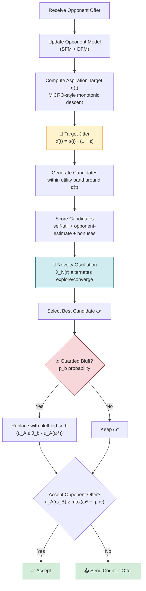
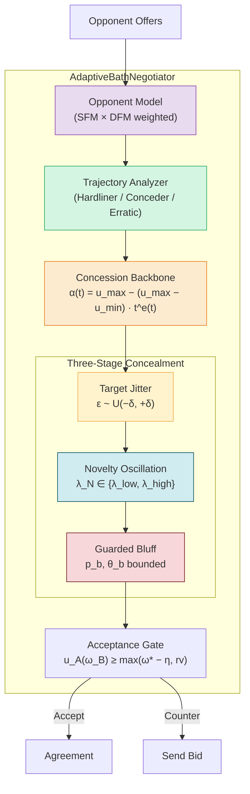
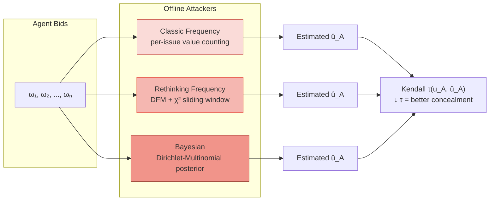

# AdaptiveBathNegotiator — ANL 2026

**Preference-concealing bilateral negotiation agent with multi-stage privacy protection.**

Built on [NegMAS](https://negmas.readthedocs.io/), designed for the Automated Negotiation League (ANL) 2026.

---

## Bidding Pipeline



*The three concealment stages (yellow/blue/red) operate at distinct intervention points: aspiration, candidate scoring, and final selection.*

---

## Core Algorithm

### 1. Concession Backbone

A MiCRO-inspired monotonic time-dependent aspiration function:

$$α(t) = u_{\max} - (u_{\max} - u_{\min}) \cdot t^{e(t)}$$

The exponent $e(t)$ adapts in real time via a sliding-window trajectory classifier that categorizes the opponent as **Hardliner**, **Conceder**, **Erratic**, or **Regular**, adjusting concession speed accordingly. The target is strictly non-increasing — no late-stage rises that risk breakdown.

### 2. Three-Stage Concealment

| Stage | Mechanism | What It Does |
|-------|-----------|-------------|
| **Aspiration** | Target Jitter | Applies small uniform noise $\epsilon_t \sim \mathcal{U}(-\delta, \delta)$ to $\alpha(t)$ before candidate generation, preventing exact reconstruction of the concession curve |
| **Candidate** | Novelty Oscillation | Alternates the novelty weight $\lambda_N(r)$ between exploration (high) and convergence (low) rounds, reducing stable frequency patterns in issue-value selection |
| **Selection** | Guarded Bluffing | With small probability $p_b$, replaces the best candidate with a bluff bid that deviates from recent patterns while satisfying $u_A(\omega_b) \geq \theta_b \cdot u_A(\omega^*)$ |

The three mechanisms target different sources of observable regularity — aspiration trajectory, value-frequency stability, and final-offer evidence — rather than adding undirected noise.

### 3. Opponent Modeling

A weighted combination of two frequency-based estimators:

- **SFM** (Smith Frequency Model) — tracks per-issue value occurrence and no-change persistence; robust early in negotiation
- **DFM** (Distribution-based Frequency Model) — sliding-window $\chi^2$ concession detection based on Rethinking Frequency Opponent Modeling

Weight shifts from SFM → DFM as more observations accumulate.

### 4. Acceptance Gate

Accepts opponent offer $\omega_B$ when:

$$u_A(\omega_B) \geq \max\{u_A(\omega^*) - \eta(t),\; rv_A\}$$

where $\eta(t)$ is small early and widens near the deadline. Decoupled from concealment — a strong incoming offer is never rejected for privacy reasons.

---

## Agent Architecture



---

## Privacy Evaluation Framework

The agent's privacy is evaluated by training three offline attacker models on the observable bid sequence:



---

## Core Advantages

- **Privacy without protocol changes** — operates entirely within the bidding strategy; compatible with standard alternating-offers protocols
- **Stage-specific concealment outperforms undirected noise** — random perturbation at equivalent intensity produces *higher* leakage than no concealment
- **Guarded bluffing is utility-bounded** — every bluff bid remains above the agent's reservation value and within a controlled loss margin
- **Adaptive concession** — opponent trajectory classification prevents over-conceding to hardliners and under-conceding to conceders
- **Modular design** — each concealment layer can be independently enabled/disabled for ablation studies
- **Lightweight opponent modeling** — no neural training or heavy computation; suitable for real-time negotiation

---

## Quick Start

```bash
pip install -r requirements.txt
```

### Single negotiation

```bash
python main.py run
```

### Tournament

```bash
python main.py tournament
```

---

## Structure

```
├── adaptive_bath_agent.py   # Core agent (AdaptiveBathNegotiator)
├── ceanl.py                 # ANL competition wrapper
├── main.py                  # CLI (Typer) — run, tournament, info
├── leakage_attackers.py     # Offline attacker models (CF, RF, Bayesian)
├── examples/                # Opponent implementations
│   ├── boa.py               #   BOANeg — frequency-based + adaptive acceptance
│   ├── map.py               #   MAPNeg — multi-strategy
│   └── simple.py            #   SimpleNegotiator — time-based conceder
├── scenarios/               # 8 benchmark domains
│   ├── Camera/  (3 issues, 175 outcomes)
│   ├── Car/     (4 issues, 1008 outcomes)
│   ├── Energy/  (4 issues, 450 outcomes)
│   ├── Grocery/ (2 issues, 35 outcomes)
│   ├── ISBTAcquisition/ (4 issues, 1260 outcomes)
│   ├── Laptop/  (3 issues, 378 outcomes)
│   ├── Party/   (3 issues, 1521 outcomes)
│   └── Travel/  (4 issues, 14256 outcomes)
└── requirements.txt
```

---

## Empirical Performance

Summary from full-scale evaluation (8 domains × 5 opponents × 30 seeds = 7,200 negotiations):

| Configuration | Self Utility | Agreement Rate | τ (Bayesian) ↓ | Exploit Loss |
|:---|:---:|:---:|:---:|:---:|
| **OFF** (no concealment) | 0.548 | 97.5% | 0.566 | 0.037 |
| Jitter only | 0.548 | 98.4% | 0.570 | 0.026 |
| Novelty only | 0.544 | 97.5% | 0.564 | 0.031 |
| **Bluff only** | 0.523 | 97.5% | **0.556** | 0.063 |
| **FULL** (all three) | 0.525 | 97.8% | 0.560 | 0.050 |
| Random baseline | 0.549 | 97.5% | 0.576 | 0.032 |

**Key findings:**
- **FULL** reduces ranking leakage (τ ↓ 0.006) at only **4.1% utility cost** vs OFF
- **Bluff-only** is the dominant concealment component (**132–175%** of FULL's τ reduction)
- **Random perturbation** produces the *highest* leakage — undirected noise backfires
- **Jitter + Novelty** reduce exploitation loss (−31%, −16%); Bluff increases it (+69%) — τ concealment and exploitation resistance can move in opposite directions

Full experimental details, per-domain breakdown, opponent-type analysis, and statistical tests are available in the accompanying paper.

---

## Dependencies

- `negmas==0.15.5` — negotiation platform
- `numpy>=2.0`
- `scipy>=1.17`
- `typer`, `rich` — CLI interface

---

## Citation

```bibtex
@article{chen2026concealing,
  title   = {Concealing Preference Information in Automated Negotiation:
             A Multi-Stage Bidding Strategy Against Opponent Modeling},
  author  = {Chen, Long and Lv, Yichen and Fujita, Katsuhide and
             Chang, Shengbo and Wu, Zigao},
  journal = {ANL 2026},
  year    = {2026}
}
```

---

## License

Academic and competition use.
