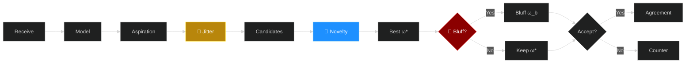
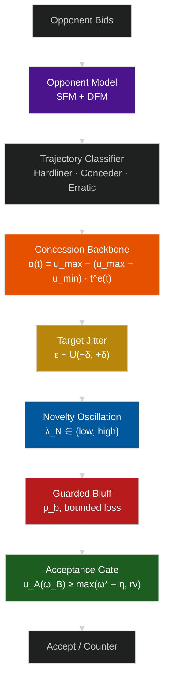
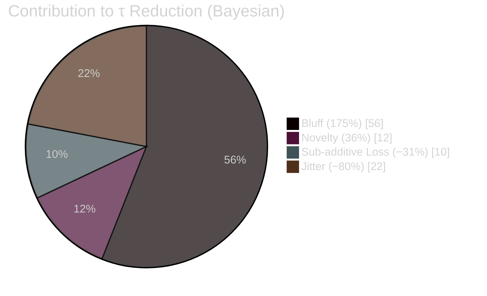

# AdaptiveBathNegotiator — ANL 2026

**Preference-concealing bilateral negotiation agent with multi-stage privacy protection.**

Built on [NegMAS](https://negmas.readthedocs.io/), designed for the Automated Negotiation League (ANL) 2026.

---

## Bidding Pipeline



---

## Architecture



---

## Three Concealment Mechanisms

| Stage | Mechanism | Formula | Purpose |
|:---|:---|:---|:---|
| **Aspiration** | Target Jitter | $\tilde{\alpha}(t) = \alpha(t)(1 + \epsilon_t),\ \epsilon_t \sim \mathcal{U}(-\delta,\delta)$ | Obscure concession trajectory |
| **Candidate** | Novelty Oscillation | $\lambda_N(r) \in \{\lambda_{\text{high}},\ \lambda_{\text{low}}\}$ alternating | Break frequency patterns |
| **Selection** | Guarded Bluff | $u_A(\omega_b) \geq \theta_b \cdot u_A(\omega^*)$ | Inject misleading evidence |

---

## Experimental Results

*8 domains × 5 opponents × 30 seeds = 7,200 negotiations. Lower τ = better privacy.*

### Privacy-Utility Trade-off

```
  Config     Self Utility              τ (Bayesian) ↓
  ──────     ───────────              ────────────
  OFF        0.548 ████████████████    0.566 ██████████████
  Jitter     0.548 ████████████████    0.570 ██████████████▌
  Novelty    0.544 ███████████████▋    0.564 █████████████▉
  Bluff      0.523 ██████████████▍     0.556 █████████████▌  ← best τ
  FULL       0.525 ██████████████▌     0.560 █████████████▊
  Random     0.549 ████████████████▏   0.576 ██████████████▊ ← worst τ
```

> FULL reduces τ by 0.006 at only **4.1% utility cost**. Random noise produces the *highest* leakage.

### Layer Contribution to τ Reduction



> Bluff is dominant. Jitter alone slightly *increases* leakage. Three layers show **sub-additive synergy** — FULL < sum of parts.

### Exploitation Loss

```
  Config     Exploit Loss  vs OFF
  ──────     ────────────  ──────
  OFF        0.037 ████    —
  Jitter     0.026 ██▊     −31% ✅
  Novelty    0.031 ███▍    −16% ✅
  Bluff      0.063 ██████▊ +69% ⚠️
  FULL       0.050 █████▌  +34%
  Random     0.032 ███▌    −15%
```

> Jitter & Novelty protect on both dimensions. Bluff reduces τ but increases exploitation vulnerability — ranking concealment and exploitation resistance can move in opposite directions.

### Performance Summary

| Configuration | Utility | Privacy (τ) | Exploit Risk | Verdict |
|:---|:---:|:---:|:---:|:---|
| OFF (baseline) | 0.548 | 0.566 | 0.037 | — |
| Jitter only | 0.548 | 0.570 | 0.026 | Safe, weak privacy |
| Novelty only | 0.544 | 0.564 | 0.031 | Safe, weak privacy |
| **Bluff only** | 0.523 | **0.556** | 0.063 | Best privacy, risky |
| **FULL** | 0.525 | 0.560 | 0.050 | Balanced |
| Random | 0.549 | 0.576 | 0.032 | No privacy benefit |

---

## Core Advantages

- **Privacy without protocol changes** — works within standard alternating-offers
- **Stage-specific beats random noise** — undirected perturbation *increases* leakage
- **Bounded bluffing** — every bid stays above reservation value with controlled loss margin
- **Adaptive concession** — real-time opponent classification (Hardliner/Conceder/Erratic)
- **Modular** — each concealment layer independently toggleable for ablation
- **Lightweight** — frequency-based models, no GPU or neural training required

---

## Quick Start

```bash
pip install -r requirements.txt
python main.py run          # single negotiation
python main.py tournament   # full tournament
```

---

## Structure

```
├── adaptive_bath_agent.py   # Core agent
├── ceanl.py                 # ANL wrapper
├── main.py                  # CLI (Typer)
├── leakage_attackers.py     # CF / RF / Bayesian attackers
├── examples/                # Opponents: BOA, MAP, Simple
├── scenarios/               # 8 domains (Camera, Car, Energy, Grocery,
│                            #   ISBTAcquisition, Laptop, Party, Travel)
└── requirements.txt
```

---

## Citation

```bibtex
@article{chen2026concealing,
  title   = {Concealing Preference Information in Automated Negotiation:
             A Multi-Stage Bidding Strategy Against Opponent Modeling},
  author  = {Chen, Long and Lv, Yichen and Fujita, Katsuhide and
             Chang, Shengbo and Wu, Zigao},
  journal = {ANL 2026},
  year    = {2026}
}
```
