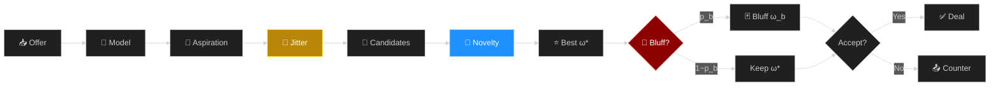
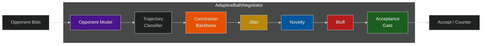

# AdaptiveBathNegotiator — ANL 2026

**Preference-concealing bilateral negotiation agent with multi-stage privacy protection.**

Built on [NegMAS](https://negmas.readthedocs.io/), ANL 2026.

---

## Bidding Pipeline



Three concealment stages intercept at distinct points in the bid-generation pipeline.

---

## Architecture



| Stage | Mechanism | Formula |
|:---|:---|:---|
| Aspiration | Target Jitter | $\tilde{\alpha}(t) = \alpha(t)(1 + \epsilon_t),\ \epsilon_t \sim \mathcal{U}(-\delta,\delta)$ |
| Candidate | Novelty Oscillation | $\lambda_N(r)$ alternates high (explore) / low (converge) |
| Selection | Guarded Bluff | $u_A(\omega_b) \geq \theta_b \cdot u_A(\omega^*)$ with probability $p_b$ |

---

## Results

*8 domains × 5 opponents × 7,200 negotiations. Lower τ = better concealment.*

### Ablation Study

| Configuration | Utility | τ (Bayesian) ↓ | Exploit Loss | Verdict |
|:---|---:|---:|---:|:---|
| **OFF** (no concealment) | 0.548 | 0.566 | 0.037 | baseline |
| Jitter only | 0.548 | 0.570 | 0.026 | safe, weak |
| Novelty only | 0.544 | 0.564 | 0.031 | safe, weak |
| **Bluff only** | 0.523 | **0.556** | 0.063 | best τ, risky |
| **FULL** (all three) | 0.525 | 0.560 | 0.050 | balanced |
| Random baseline | 0.549 | 0.576 | 0.032 | worst τ |

> FULL reduces τ by 0.006 at **4.1% utility cost**. Random perturbation produces the *highest* leakage — worse than no concealment.

### Layer Contribution (Bayesian Attacker)


Bluff is dominant. Three layers are **sub-additive** — the combined effect is smaller than the sum of individual contributions.

### Exploitation Asymmetry

Jitter and Novelty reduce exploitation loss (−31%, −16%). Bluff increases it by **+69%** while achieving the best τ concealment. Ranking concealment and exploitation resistance can move in opposite directions — a trade-off to consider when selecting concealment layers.

---

## Advantages

- **Stage-specific concealment outperforms random noise** — undirected perturbation increases leakage
- **No protocol changes needed** — operates within standard alternating-offers
- **Bounded bluffing** — every bluff bid above reservation value, controlled loss margin
- **Adaptive concession** — opponent trajectory classification: Hardliner / Conceder / Erratic
- **Modular design** — each concealment layer independently toggleable
- **Lightweight** — frequency-based opponent models, no GPU or neural training

---

## Quick Start

```bash
pip install -r requirements.txt
python main.py run          # single negotiation
python main.py tournament   # full tournament
```

---

```
adaptive_bath_agent.py   # Core agent (AdaptiveBathNegotiator)
ceanl.py                 # ANL competition wrapper
main.py                  # CLI entry point
leakage_attackers.py     # CF / RF / Bayesian attacker models
examples/                # Opponent implementations
scenarios/               # 8 benchmark domains
requirements.txt
```

---

## Citation

```bibtex
@article{chen2026concealing,
  title   = {Concealing Preference Information in Automated Negotiation:
             A Multi-Stage Bidding Strategy Against Opponent Modeling},
  author  = {Chen, Long and Lv, Yichen and Fujita, Katsuhide and
             Chang, Shengbo and Wu, Zigao},
  journal = {ANL 2026},
  year    = {2026}
}
```
